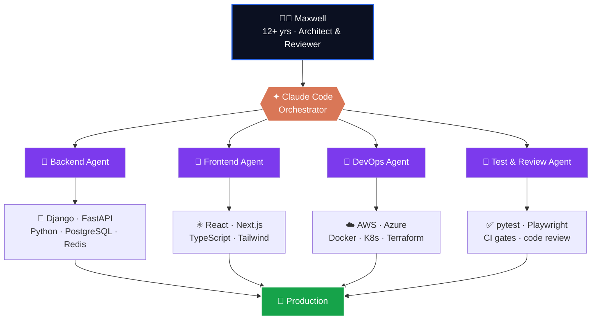
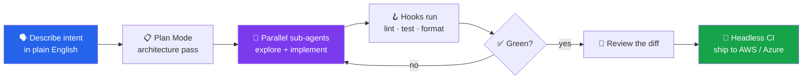

<!-- ========================= HEADER BANNER ========================= -->

<!-- ========================= TYPING INTRO ========================= -->

<!-- profile views + followers + a fun badge row -->

---

## 🧠 About Me — One Engineer Orchestrating a Fleet

> Senior Full-Stack & AI-Native Engineer in the **United States 🇺🇸** with **12+ years** in production software.
> I direct **Claude Code sub-agents** like a tech lead directs a team — fanning them out across the entire stack while I own the architecture.

<i>Sub-agents do the parallel toil across the stack — I stay focused on design, trade-offs, and the diff.</i>

---

## ✦ 1. Claude Code — My AI-Native Development Engine

> *"The hottest new programming language is English."* — **Andrej Karpathy**, who popularized **vibe coding**.
> Claude Code, created by **Boris Cherny** at Anthropic, is the agentic terminal that turns that idea into shipped software — and it's where I spend most of my engineering day.

I treat Claude Code as a **fleet of engineers in my terminal**, not an autocomplete. My workflow is heavily inspired by **Andrej Karpathy's** agent-first mindset and **Boris Cherny's** "let the agent run, then review the diff" philosophy.

### 🔧 The Claude Code features I lean on every day

| Feature | How I use it to build powerful processes |
| :-- | :-- |
| 🤖 **Sub-agents (parallel fleets)** | Spin up multiple agents to explore, plan, and implement different parts of a feature *in parallel* — then merge the diffs. |
| 🧩 **MCP servers** | Wire Claude into Postgres, GitHub, Sentry, AWS, and internal APIs so the agent acts on **live context**, not guesses. |
| 🪝 **Hooks** | Auto-run linters, tests, and formatters on every edit — the agent self-corrects before I ever see the code. |
| ⚡ **Custom slash commands** | Reusable `/deploy`, `/code-review`, `/security-review` workflows encoded once, run forever. |
| 🧠 **CLAUDE.md memory** | Project conventions, architecture, and guardrails live in repo so every session starts *fully briefed*. |
| 📋 **Plan Mode** | Read-only architecture passes before a single line changes — no surprises in the diff. |
| 🛠️ **Skills** | Packaged, repeatable capabilities (API scaffolds, migrations, IaC) the agent invokes on demand. |
| 🚀 **Headless mode (`claude -p`)** | Drop Claude Code straight into **CI/CD** for automated reviews, refactors, and changelogs. |

### 🔁 My real-world Claude Code loop

**Result:** features that used to take days now ship in hours — with tests, reviews, and infra changes handled by agents while I stay focused on architecture and product.

---

## ✦ 2. Full-Stack Engineering

> Django + FastAPI on the back, React + TypeScript on the front, glued with clean APIs and real tests.

### Languages & Core

### Backend

### Frontend

<b>🧪 What I actually build (click to expand)</b>

 

- **APIs:** Django REST Framework & FastAPI services with async I/O, Pydantic validation, OpenAPI docs, and JWT/OAuth2 auth.
- **Frontends:** React + Next.js apps with TypeScript, server components, and design-system-driven UIs.
- **Data:** PostgreSQL + Redis, migrations, query tuning, Celery/async task queues.
- **Quality:** pytest, Playwright, type checking, and CI gates — agents keep coverage honest.

---

## ✦ 3. DevOps · AWS · Azure

> Infrastructure as code, containers everywhere, and pipelines that deploy themselves.

### Cloud & Platforms

### Containers, IaC & CI/CD

| Area | Toolbelt |
| :-- | :-- |
| **AWS** | ECS / EKS · Lambda · S3 · RDS · CloudFront · IAM · CloudWatch |
| **Azure** | AKS · App Service · Functions · Blob Storage · Azure DevOps · Entra ID |
| **IaC & Automation** | Terraform · Ansible · Helm · GitHub Actions · Docker Compose |
| **Observability** | Prometheus · Grafana · CloudWatch · Sentry |

---

## 📊 GitHub Analytics

 

 

 

---

## 💬 A meme to close on

> *"It works on my machine."*  —  so I shipped the machine. 🐳

---

